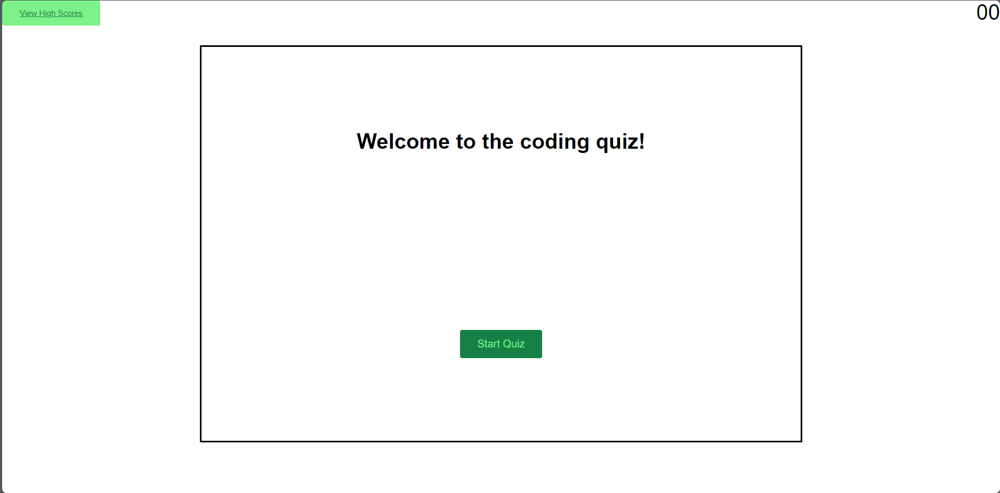
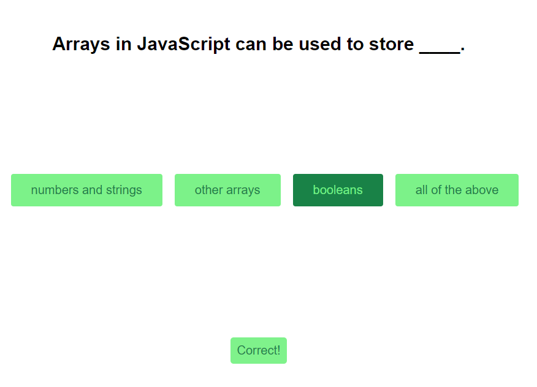
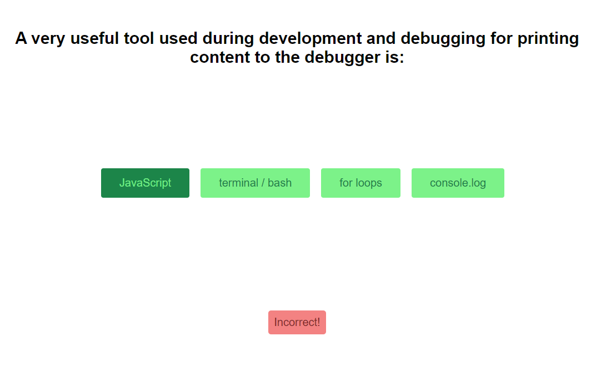

# Coding-Quiz

## Description
I created this to further my knowledge with javascript, using more advanced functions and methodologies. My main experience this project was with DOM, element creation and traversal. SetTimeout and SetInterval functions.
As well as local storage stringify and parsing. I built upon my previous css and js knowledge gaining new tools in my skillset such as css opacity and transition as well as JS array sorting 

My main challenge came in the form of getting the quiz to iterate through questions. It took a lot of backtracking and youtube videos for me to finally understand what needed to be done. I did struggle with my local storage array parsing at first but was able to simply add "||[]" to the end of my code which created the array I needed. After that it was smooth sailing

## Installation
N/A just follow the link provided!: https://lwse13.github.io/Coding-Quiz/
## Usage
You will be greeted by a welcome page asking you to start the quiz. Press the start button to begin

You will be given a series of questions, each with their corresponding choices to select from. Upon clicking a correct answer, a green "Correct"  alert will appear at the bottom of the screen. If the answer is incorrect. A red "incorrect" alert will be shown at the bottom of the screen

Upon quiz completion you will be given a score. You can enter your initials and submit them to the high score page. you will be able to clear your high scores at any time just in case you would like to start from scratch :)

## Credits
N/A
## License
N/A
